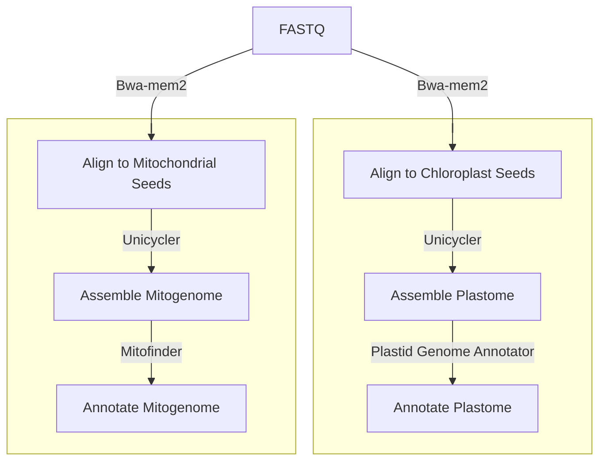

# Organelle assembly and annotation

The [`organelle.nf`](https://github.com/Tom-Jenkins/maerl-wgs-pipelines/blob/main/src/fastp.nf) nextflow script will take any number of trimmed reads in the following format: `*_trim_R{1,2}.fq.gz`. The outputs of this pipeline are an annotated mitochondrial and chloroplast genome. If part of the pipeline is unsuccessful for a sample then these errors are ignored and no assembly or annotation files will be outputted for that sample.

Pipeline flowchart:



**Example input:**
```
$ ls trimmed_reads/
```
```
Sample_ID_trim_R1.fq.gz SRR13356911_trim_R1.fq.gz
Sample_ID_trim_R2.fq.gz SRR13356911_trim_R2.fq.gz
```

## 1. Software requirements

### 1.1 Install Unicycler

First, create a conda environment for [Unicycler](https://github.com/rrwick/Unicycler) v0.5.0.
```
# Create conda env
mamba create -n unicycler -c bioconda unicycler=0.5.0

# Print env paths on system
mamba env list
```
Second, edit path to the unicycler conda environment in the `organelle.nf` script (line 81 and 169).
```
conda "/path/to/mambaforge3/envs/unicycler"
```

### 1.2 Install dependencies (version used)

* [Bwa-mem2](https://github.com/bwa-mem2/bwa-mem2) (2.0pre2)
* [Samtools](https://github.com/samtools/samtools) (1.16.1)
* [Mitofinder](https://github.com/RemiAllio/MitoFinder) (1.4.1)
* [PGA](https://github.com/quxiaojian/PGA) (plastid genome annotator)
* [gbseqextractor](https://github.com/linzhi2013/gbseqextractor)
* [SeqKit](https://bioinf.shenwei.me/seqkit/) (2.3.0)
* [EDirect](https://www.ncbi.nlm.nih.gov/books/NBK179288/) (17.8)


## 2. Prepare reference sequences

### 2.1 Download seeds

`efetch -db nucleotide -id MW357900.2,MW357901.2,MH281621.1 -format fasta > maerl-mitochondrion-seeds.fa`

`efetch -db nucleotide -id OQ417768.1,OQ417769.1,MH281627.1 -format fasta > maerl-chloroplast-seeds.fa`

### 2.2 Download GenBank references

`efetch -db nucleotide -id MW357900.2 -format gb > MW357900-mitochondrion-reference.gb`

`efetch -db nucleotide -id OQ417768.1 -format gb > chloroplast_references/OQ417768-chloroplast-reference.gb`

`efetch -db nucleotide -id OQ417769.1 -format gb > chloroplast_references/OQ417769-chloroplast-reference.gb`

`efetch -db nucleotide -id MH281627.1 -format gb > chloroplast_references/MH281627-chloroplast-reference.gb`


## 3. Run organelle nextflow script

```
nextflow run ./src/organelle.nf \
    --cpus 16 \
    --reads /path/to/trimmed_reads \
    --mito_seed /path/to/maerl-mitochondrion-seeds.fa \
    --mito_ref /path/to/MW357900-mitochondrion-reference.gb \
    --plastid_seed /path/to/maerl-chloroplast-seeds.fa \
    --plastid_ref /path/to/chloroplast_references/ \
    --outdir /path/to/output_dir/
```

| Parameter | Description
| :- | :-
| --cpus | number of threads
| --reads | directory path containing input trimmed FASTQ files
| --mito_seed | file path to the mitochondrion seeds sequences
| --mito_ref | file path to the mitochondrion GenBank references
| --plastid_seed | file path to the chloroplast seeds sequences
| --plastid_ref | directory path containing GenBank (.gb) references
| --outdir | directory path for output files


## Output

The output of `organelle.nf` are two directories called `mitochondrial_genomes/` and `chloroplast_genomes/` that are automatically created in the `--outdir` path. In these directories are subdirectories for each sample which in turn contain the assembly and annotation output files.

**Example output:**
```
$ ls mitochondrial_genomes/SampleID1/
```
```
annotation/ assembly.fasta
```


## 4. Extract COX1 and psbA gene sequences

Samples that run successfully will have several annotation files in the output directory. The following bash code extracts all COX1 / psbA nucleotide gene sequences annotated for each sample and saves the output to a single FASTA file.

```
cat mitochondrial_genomes/*/*/*/*Results/*final_genes_NT.fasta | seqkit grep -r -p "COX1" > COX1.fasta
```
```
cat chloroplast_genomes/*/annotation/*.cds.fasta | seqkit grep -r -p "psbA" > psbA.fasta
```

**Example output:**
```
SampleID1@COX1
[sequence]
SampleID2@COX1
[sequence]
...
...
```
```
SampleID1;psbA;len=XXXX
[sequence]
SampleID2;psbA;len=XXXX
[sequence]
...
...
```

