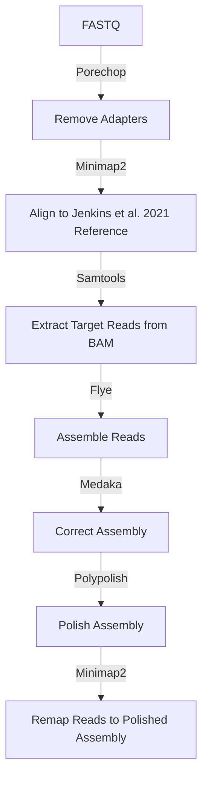

# Reference genome assembly

The [`assembly.nf`](https://github.com/Tom-Jenkins/maerl-wgs-pipelines/blob/main/src/assembly.nf) nextflow script will take any number of samples with Nanopore reads preprocessed with Guppy to output a single FASTQ file in the following format: `*.fastq.gz`. It also requires Illumina paired-end read data for each sample for polishing. The outputs of this pipeline are an assembly FASTA file, a consensus FASTA file, a polished FASTA file, and a polished BAM file. If part of the pipeline is unsuccessful for a sample then these errors are ignored and no assembly files will be outputted for that sample.

Pipeline flowchart:



**Example input:**
```
$ ls nanopore_reads/
```
```
Sample_ID1_fastq.gz Sample_ID3_fastq.gz
Sample_ID2_fastq.gz Sample_ID4_fastq.gz
```


## 1. Software requirements

### 1.1 Install Porechop

First, create a conda environment for [Porechop](https://github.com/rrwick/Porechop) v0.2.4.
```
# Create conda env
mamba create -n porechop -c bioconda porechop=0.2.4

# Print env paths on system
mamba env list
```
Second, edit path to the porechop conda environment in the `assembly.nf` script (line 64).
```
conda "/path/to/mambaforge3/envs/porechop"
```

### 1.2 Install dependencies (version used)

* [Bwa-mem2](https://github.com/bwa-mem2/bwa-mem2) (2.0pre2)
* [Samtools](https://github.com/samtools/samtools) (1.16.1)
* [Flye](https://github.com/fenderglass/Flye) (2.9.1-b1780)
* [Medaka](https://github.com/nanoporetech/medaka) (1.7.2)
* [Polypolish](https://github.com/rrwick/Polypolish) (0.5.0)


## 2. Download *Phymatolithon calcareum* draft reference (Jenkins *et al*. 2021)

Download [*P. calcareum* reference](https://github.com/Tom-Jenkins/maerl_genomics/blob/main/4.Reference_assembly/assembly_Mor02_final.fasta) assembled in a [previous study](https://doi.org/10.1111/eva.13219) using short-read Illumina data to current working directory.
```
wget https://github.com/Tom-Jenkins/maerl_genomics/raw/main/4.Reference_assembly/assembly_Mor02_final.fasta
```


## 3. Run assembly nextflow script

```
nextflow ./src/assembly.nf \
    --cpus 16 \
    --nano_reads /path/to/nanopore_reads/ \
    --illumina_reads /path/to/illumina_reads/ \
    --pcalcareumREF /path/to/Pcalcareum_FASTA \
    --outdir /path/to/output_dir/
```

| Parameter | Description
| :- | :-
| --cpus | number of threads
| --nano_reads | directory path containing input Nanopore FASTQ files
| --illumina_reads | directory path containing input Illumina FASTQ files
| --pcalcareumREF | file path to the *P. calcareum* reference in FASTA format
| --outdir | directory path for output files


## Output

The output of `assembly.nf` are subdirectories for each sample which contain the enriched target reads in FASTQ format, the assembly outputs from Flye, Medaka and Polypolish, and the BAM files from remapping the reads to the polished assembly.

**Example output:**
```
$ ls SampleID1/
```
```
assembly.fasta polished.fasta
consensus.fasta polished.sorted.bam
enrich_SampleID1.fq polished.sorted.bam.stats
```


## 4. Filtering the assembly

IN PROGRESS
