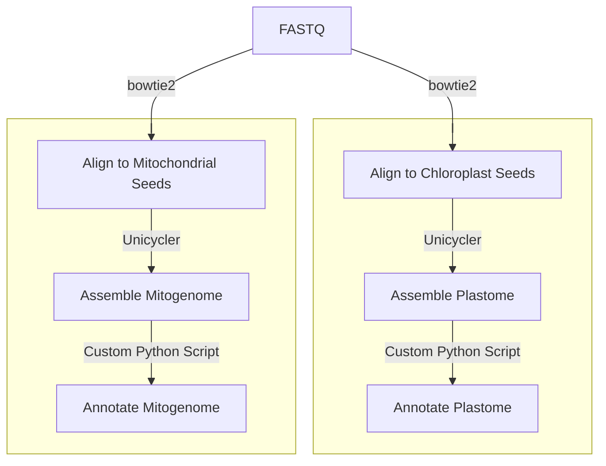

# Organelle assembly and annotation

The [`organelle.nf`](https://github.com/Tom-Jenkins/maerl-wgs-pipelines/blob/main/src/organelle.nf) nextflow script will take any number of samples with paired-end reads in FASTQ format and output an annotated mitochondrial and chloroplast genome. If part of the pipeline is unsuccessful for a sample then these errors are ignored and no assembly or annotation files will be produced for that sample.

Pipeline flowchart:



## Dependencies (version tested)
* Nextflow (23.10.1)
* Java (18.0.2.1)
* Python (3.10)
* bowtie2 (2.5.3)
* SAMtools (1.19.2)
* Unicycler (0.5.0)
* BLAST+ (2.15.0)
* biopython

## Conda Environment

Create environment using conda:   
`conda env create -f ./nextflow-pipelines/env/organelle.yml`  

Activate conda environment:  
`conda activate organelle` or `source activate organelle`

## Prepare reference files

### Download seed sequences for species of interest
```
# Activate conda environment
conda activate organelle

# Create directory to store references
mkdir references

# Download organelle genomes (replace -id with your accession IDs)
efetch -db nucleotide -id MW357900.2,MW357901.2,MH281621.1 -format fasta > references/mitochondrion-seeds.fa
efetch -db nucleotide -id OQ417768.1,OQ417769.1,MH281627.1 -format fasta > references/chloroplast-seeds.fa
```

### Download GenBank references
```
# Activate conda environment
conda activate organelle

# Download one or more GenBank Reference files (replace -id with your accession IDs)
efetch -db nucleotide -id MW357900.2 -format gb > references/mitochondrion-reference.gb
efetch -db nucleotide -id OQ417768.1 -format gb > references/chloroplast-reference1.gb
efetch -db nucleotide -id OQ417769.1 -format gb > references/chloroplast-reference2.gb
efetch -db nucleotide -id MH281627.1 -format gb > references/chloroplast-reference3.gb
```

## Usage
```
#!/bin/bash

# Activate conda environment
conda activate organelle

# Variables
cpus=20
reads=/path/to/reads/directory
ref=/path/to/references/directory
outdir=/path/to/output/directory

# Index reference seed sequences
bowtie2-build ${ref}/mitochondrion-seeds.fa ${ref}/mitochondrion-seeds.fa
bowtie2-build ${ref}/chloroplast-seeds.fa ${ref}/chloroplast-seeds.fa

# Run pipeline
nextflow run ~/nextflow-pipelines/src/organelle.nf \
    --reads ${reads} \
    --suffix "_{1,2}.fq.gz" \
    --mitogenome \
    --mito_seed ${ref}/mitochondrion-seeds.fa \
    --mito_ref ${ref}/mitochondrion-reference.gb \
    --plastome \
    --plastid_seed ${ref}/chloroplast-seeds.fa \
    --plastid_ref ${ref}/chloroplast-reference1.gb,${ref}/chloroplast-reference2.gb,${ref}/chloroplast-reference3.gb \
    --outdir ${outdir} \
    --cpus ${cpus}
```

| Parameter&nbsp;&nbsp;&nbsp;&nbsp;&nbsp;&nbsp;&nbsp;&nbsp;&nbsp;&nbsp;&nbsp;&nbsp;&nbsp;&nbsp;&nbsp;&nbsp;&nbsp;&nbsp;&nbsp;&nbsp;&nbsp;&nbsp;&nbsp;&nbsp;&nbsp;&nbsp;&nbsp;&nbsp;&nbsp;&nbsp;&nbsp;&nbsp;&nbsp;&nbsp; | Description
| :- | :-
| `--reads` | path to input directory containing FASTQ files
| `--suffix` | string denoting the suffix after a sample name and the forward (read1) and reverse (read2) designation (e.g. for read pair `sample_1.fq.gz` and `sample_2.fq.gz` set the parameter to `--suffix "_{1,2}.fq.gz"`)
| `--mitogenome` | run the mitogenome pipeline (this or `--plastome` required)
| `--mito_seed` | file path to the mitochondrion seeds sequences (.fa)
| `--mito_ref` | file path to the mitochondrion GenBank references (.gb). Multiple reference files separated by a comma.
| `--plastome` | run the plastome pipeline (this or `--mitogenome` required)
| `--plastid_seed` | file path to the chloroplast seeds sequences (.fa)
| `--plastid_ref` | file path containing GenBank references (.gb). Multiple reference files separated by a comma.
| `--outdir` | path to output directory
| `--test` | prints out a tuple of the sample ID and paths to the input paired reads (dry run)
| `--nextflow_pipelines_path` | path to nextflow pipelines directory (default: `${HOME}/nextflow-pipelines`)
| `--cpus` | integer denoting the number of cpus (default: `16`)

**Example input:**  
```
$ ls reads/
SampleID_01_1.fq.gz SampleID_02_1.fq.gz
SampleID_01_2.fq.gz SampleID_02_2.fq.gz
```

## Output

The output of `organelle.nf` are two directories called `mitochondrial_genomes/` and `chloroplast_genomes/` that are automatically created in the `--outdir` path. In these directories are subdirectories for each sample which contain the assembly (assembly.fasta) and annotation (sampleID.cds.fasta) output files.

**Example output:**
```
$ ls ${outdir}/mitochondrial_genomes
SampleID_01 SampleID_02

$ ls ${outdir}/chloroplast_genomes
SampleID_01 SampleID_02
```

## Extract annotated gene sequences

Samples that run successfully will have a coding sequences (CDS) FASTA file in their output directory. The code below allows users to extract specific genes that were annotated (e.g. COX1 or psbA).
```
$ cat mitochondrial_genomes/*/*.cds.fasta | seqkit grep -r -p "COX1" > COX1.fasta
$ cat chloroplast_genomes/*/*.cds.fasta | seqkit grep -r -p "psbA" > psbA.fasta
```
