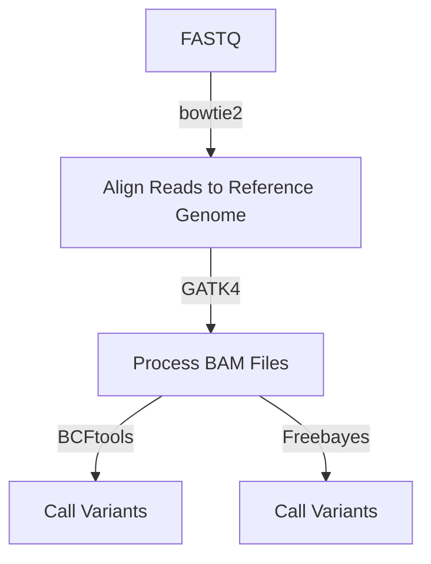

# Reference genome assembly
The [`variantcalling.nf`](https://github.com/Tom-Jenkins/maerl-wgs-pipelines/blob/main/src/variantcalling.nf) nextflow script will take any number of samples with paired-end reads in FASTQ format, map reads using Bowtie2, processed bam fildes, and finally call variants using BCFtools v1.21 and/or Freebayes v1.3.6. If part of the pipeline is unsuccessful for a sample then these errors are ignored.

Pipeline flowchart:



## Dependencies (version tested)
* Nextflow (24.04.4)
* Java (18.0.2.1)
* Python (3.10)
* bowtie2 (2.5.3)
* SAMtools (1.19.2)
* GATK4 (4.5)
* BCFtools (1.21)
* Freebayes (1.3.6)

## Conda Environment

Create environment using conda:   
`conda env create -f ./nextflow-pipelines/env/variantcalling.yml`  

Activate conda environment:  
`conda activate variantcalling` or `source activate variantcalling`

## Setup
### Sample Sheet
The sample sheet is a __CSV__ file with five columns. Make sure the column headings are exactly the same as below.

Column 1: __sample__ (sample name)  
Column 2: __library__ (sample name if individual libraries built for each sample)  
Column 3: __run__ (if samples were sequenced on different runs use this column to specify)  
Column 4: __read1__ (absolute path to read1.fq.gz)  
Column 5: __read2__ (absolute path to read2.fq.gz)  

Example of a sample_sheet.csv:
| sample | library | run | read1 | read2
| ---  | --- | ---  | --- | ---
| sample_01 | sample_01 | Dec_2022 | /home/path/read1.fq.gz | /home/path/read2.fq.gz
| sample_02 | sample_02 | Dec_2022 | /home/path/read1.fq.gz | /home/path/read2.fq.gz
| sample_03 | sample_03 | Jun_2023 | /home/path/read1.fq.gz | /home/path/read2.fq.gz
| sample_04 | sample_04 | Jun_2023 | /home/path/read1.fq.gz | /home/path/read2.fq.gz 

## Usage
```
#!/bin/bash

# Activate conda environment
conda activate variantcalling

# Variables
cpus=20
sampleSheet=/path/to/sample/sheet.csv
genome=/path/to/reference/genome.fasta
outdir=/path/to/output/directory

# Index reference genome
bowtie2-build ${genome} ${genome}

# Run pipeline
nextflow run ~/nextflow-pipelines/src/variantcalling.nf \
    --sampleSheet ${sampleSheet} \
    --genome ${genome} \
    --outdir ${outdir} \
    --variantCaller "both" \
    --vcf "variants" \
    --cpus 20
```

| Parameter&nbsp;&nbsp;&nbsp;&nbsp;&nbsp;&nbsp;&nbsp;&nbsp;&nbsp;&nbsp;&nbsp;&nbsp;&nbsp;&nbsp;&nbsp;&nbsp;&nbsp;&nbsp;&nbsp;&nbsp;&nbsp;&nbsp;&nbsp;&nbsp;&nbsp;&nbsp;&nbsp; | Description
| :- | :-
| `--sampleSheet` | sample sheet in CSV format
| `--genome` | path to reference genome (index genome before running pipeline)
| `--outdir` | path to output directory
| `--variantCaller` | `"bcftools"`, `"freebayes"`, or `"both"`
| `--bcftools_mpileup` | string of additional arguments passed to `bcftools mpileup` (e.g. "--min-MQ 40 --min-BQ 30")
| `--bcftools_call` | string of additional arguments passed to `bcftools call` (e.g. "--ploidy 2 --multiallelic-caller --variants-only")
| `--freebayes_params` | string of additional arguments passed to `freebayes` (e.g. "-p 2 --min-mapping-quality 40 --min-base-quality 30 --min-alternate-count 5 -g 200 --genotype-qualities")
| `--vcf` | string denoting the output VCF prefix
| `--test` | prints out a tuple of the sample ID and paths to the input paired reads (dry run)
| `--cpus` | integer denoting the number of cpus (default: `16`)

## Input

```
$ ls sample_sheet/
sample_sheet.csv

$ ls genome/
GCA_040759855.1_ASM4075985v1_genomic.fna
GCA_040759855.1_ASM4075985v1_genomic.fna.1.bt2
GCA_040759855.1_ASM4075985v1_genomic.fna.2.bt2
GCA_040759855.1_ASM4075985v1_genomic.fna.3.bt2
GCA_040759855.1_ASM4075985v1_genomic.fna.4.bt2
GCA_040759855.1_ASM4075985v1_genomic.fna.rev.1.bt2
GCA_040759855.1_ASM4075985v1_genomic.fna.rev.2.bt2
```

## Output

```
$ ls ${outdir}
variants_bcftools.vcf.gz
variants_freebayes.vcf.gz
```
